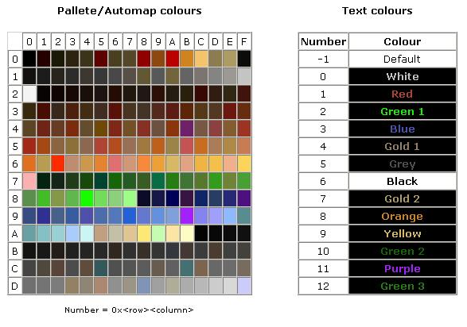

# d2hackmap颜色配置

## 物品颜色配置
``` 
Item Colours[物品编号] [质量]  [无形否]  [孔数] :   物品名字颜色,  小地图颜色1,  小地图颜色2,  小地图颜色3
```

物品代码可以在***Hackmap.vcb***查到，该文件可以用记事本等文本工具打开，如：
`Colossus Sword, 7fb: 234  (全称,代码:序号)`

支持范围值可以这样写： 
* 单个值：[1], 
* 多个值：[1,3,5],
* 连续范围数值：[1-5]

### 物品质量
 1 | 2 | 3 | 4 | 5 | 6 | 7 | 8
 -- | -- | -- | -- | -- | -- | -- | --
破碎|普通|超强|魔法(蓝色)|套装(绿色)|稀有(黄金)|独有(暗金)|橙色(合成物)

支持范围值

### 物品形态(ETH)
1|2
--|--
有形|无形

支持范围值

### 孔数
孔数|值(孔数+1)
--|--
无孔|1
1孔|2
2孔|3
3孔|4
4孔|5
5孔|6
6孔|7

支持范围值


### 物品名字颜色
-1| 代码
--|--
默认颜色|值范围：0~12 *(参考下图Text Colors)*

### 小地图颜色：
-2 | -1 | 代码
--|--|--
不显示(默认值)|地面显示，地图隐藏|自定义，两位十六进制格式*0x00*,参考颜色表如下：



## 隐藏低于某个等级的物品
设置物品过滤条件，满足条件的物品将被隐藏
```
Item Hide Lvl[物品编号] [质量]:  物品显示级别下限
```

---
## 使用说明

先看下这段配置：
```yaml
Switch Item Show Mode:              1,VK_9          
Default Item Show Mode:             1                   
Item Colours[30][2,3][1,2][1,6]:    8,0x60,-1,-2
```

`Switch Item Show Mode`：启用模式切换，并指定快捷键为 <kbd>按键9</kbd>

`Default Item Show Mode`: 设定默认显示模式

`Item Colours[30][2,3][1,2][1,6]:    8,0x60,-1,-2`

30是水晶剑，[2,3]只普通和超强，[1,2]有形和无形，[1,6]指0孔和5孔，8是地面显示为橙色，0x60，-1，-2分别是小地图三个模式下的颜色。

在进游戏时,默认处于模式1(0x60)下,水晶剑扔地上会在小地图上显示一个橙色的图标
按下 <kbd>按键9</kbd>,切换到模式2(-1),小地图图标消失,但按alt键还是可以看到水晶剑
再按下<kbd>按键9</kbd>,切换到模式3(-2),水晶剑将从地上消失,按alt也看不见
再按下<kbd>按键9</kbd>,又切换回了模式1,小地图重新显示橙色图标

` Item Hide Lvl[30][2,3]: 88`
表示过滤 等级*低于* 88的普通和超强的水晶剑
